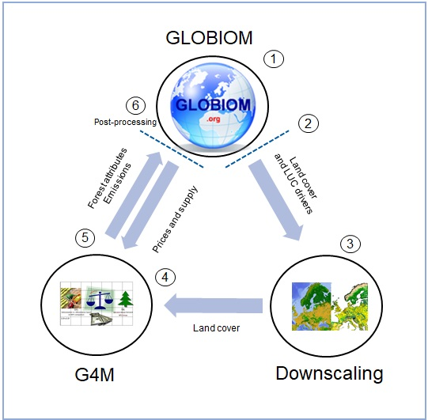

Before using this notebook, please first read the [introductory documentation](https://iiasa.github.io/GLOBIOM-G4M-link). Run the code chunks in first-to-last order. You can have RStudio run all chunks in one go, but to configure and test your setup---and because some chunks take a long time to run---it is advisable to start out by running chunks one-by-one at least until you have verified that everything is working smoothly.

Carefully check the output of each chunk for errors, and if present make adjustments and re-run the chunk that failed.

## Read the default configuration and list of optional configuration settings

```{r}
# Remove any objects from environment and read the default configuration
rm(list=ls())
source("R/configuration/default.R")

# Collect the names and types of the default config parameters
config_names <- ls()
config_types <- lapply(lapply(config_names, get), typeof)

# Read list of optional config settings and remove mandatory settings from the environment
source("R/configuration/optional.R")
rm(list=config_names[!(config_names %in% OPTIONAL_CONFIG_SETTINGS)])
```

## Load required packages

```{r}
library(gdxrrw)
suppressWarnings(library(tidyverse))
library(stringr) # part of the tidyverse, but not attached by default
library(fs)
library(data.table) #for function "fwrite" which is much faster than write.csv or write.table
```

## Customize configuration

```{r}
custom_configuration_file <- "R/configuration/custom.R"

# Check that a custom configuration exists, edit a new one otherwise.
if (!file_exists(custom_configuration_file)) {
  warning("Custom configuration file missing, please customize.")
  file_copy("R/configuration/default.R", custom_configuration_file)
  rstudioapi::navigateToFile(custom_configuration_file)
}
```

## Load and check custom configuration

When all if fine, the configuration is echoed.

```{r}
source(custom_configuration_file, local=TRUE, echo=FALSE)
source("R/configuration/check_and_echo.R")
```

## Check that submodules and a GLOBIOM branch are available

When executing this chunk fails, [read this](https://iiasa.github.io/GLOBIOM-G4M-link/#getting-set).

```{r}
if (!file_exists(path("Condor_run_R", "Condor_run.R"))) stop ("Condor_run_R submodule content is missing!")
if (!file_exists(path(WD_DOWNSCALING, "README.md"))) stop ("DownScaling submodule content is missing!")
if (!dir_exists(path(WD_GLOBIOM, "Model"))) stop ("No GLOBIOM branch has been checked out!")
```

## Set up directories and functions

```{r}
# Cache working directory, should equal the root directory of the repo's working tree.
CD <- getwd()

# Canonicalize path to temporary directory for this R session
TEMP_DIR <- path(tempdir())

# Source support functions
source("R/run_submission.R")
source("R/transfer.R")
source("R/post_processing.R")
source("R/helper_functions.R")

# Compile G4M
compile_g4m_model()

# Compile G4M output processing library
compile_table_merger()

# Load dll with G4M report generation routine
dyn.load(path(CD,WD_G4M,"/tableMergeForLinker/merge_files.so"))
```

## 0. If restarting Rstudio session (and finished runs not saved to Rproject or RData)
```{r}
# setwd(dirname(rstudioapi::getSourceEditorContext()$path)) ##copy to Console to run

# Manually put the cluster number for finished GLOBIOM and Downscaling jobs here:
cluster_nr_globiom <- "XXXX"
cluster_nr_downscaling <- "XXXX"

```

## 1. Run GLOBIOM scenarios

```{r}
cluster_nr_globiom <- run_globiom_scenarios()

print("GLOBIOM scenarios run complete.")
```

## 2. Run initial post-processing

Merge and export GLOBIOM output for use by downscaling and G4M.

```{r}
run_initial_postproc(cluster_nr_globiom, mergeGDX=TRUE)

print("Initial post processing complete.")
```

## 3a. Perform the initial downscaling - needs data from the initial GLOBIOM run

```{r}
if (!file_exists(path(WD_DOWNSCALING,"input",str_glue("output_landcover_{PROJECT}_{DATE_LABEL}.gdx"))))
  stop("File for downscaling not found! Please call the intial GLOBIOM run before downscaling")

cluster_nr_downscaling <- run_initial_downscaling()

print("Initial downscaling complete")
```

## 3b. Merge downscaling outputs and transfer them to G4M

```{r}

# Transfer downscaled output to G4M input folder

# For large simulations parallelize file transfer 
if (length(SCENARIOS_FOR_DOWNSCALING) < 50){
  merge_and_transfer(cluster_nr_downscaling)
} else {
  run_merge_and_transfer(cluster_nr_downscaling)
}

```

## 3c. Generate CSV input files for G4M

```{r}
if (!file_exists(path(PATH_FOR_G4M, str_glue("GLOBIOM2G4M_output_LC_abs_{PROJECT}_{DATE_LABEL}_1.csv"))))
  stop("File for G4M run not found! Please perform intial downscaling first.")

gdx_to_csv_for_g4m()

## copying Protection layer file (if needed) to the created G4M folder "\G4M\Data\GLOBIOM\". This "_Example.csv" can be used to adapt for current scenarios.
if(file_exists("G4M\\Data\\Default\\Protect_output_LC_abs_Example.csv")){
file.copy("G4M\\Data\\Default\\Protect_output_LC_abs_Example.csv", paste0("G4M\\Data\\GLOBIOM\\",PROJECT,"_",DATE_LABEL,"\\Protect_output_LC_abs_",PROJECT,"_",DATE_LABEL,".csv"))
}

```

## 4. Preliminary: Run baseline G4M scenarios---needs data from the intial downscaling

```{r}
run_g4m(baseline = TRUE)

print("G4M baseline scenario run complete")
```

## 5a. Preliminary: Run G4M scenarios---needs data from the intial downscaling and G4M baseline scenarios

```{r}
allfiles <- dir_ls(path(CD, str_glue("{WD_G4M}"), "out", str_glue("{PROJECT}_{DATE_LABEL}"), "baseline"))
base_files <- str_detect(allfiles,"NPVbau_[:print:]+.bin")
if (!any(base_files)) stop("Baseline G4M run not found! Please run the baseline before the G4M scenarios")

# Run G4M - final scenarios
run_g4m(baseline = FALSE)

print("G4M scenario run complete")
```

## 5b. Preliminary: Compile G4M data and produce the report for GLOBIOM---needs data from the G4M run

```{r}
compile_g4m_data(baseline = FALSE)

## Post-process merged g4m result (tab_gui_xxx_.csv): replace nan (in Malta and Svalbard_and_Jan_Mayen) with zero - The NAN values exist after MG updated G4M to REGION59 in Aug 2024
file_outpath <- path(CD,WD_GLOBIOM,"Model","output","g4m",str_glue("{PROJECT}_{DATE_LABEL}"))
file_g4m_result_name <- path(file_outpath,G4M_FEEDBACK_FILE)

df.g4m.result.raw <- read.csv(file=file_g4m_result_name,header=TRUE)
df.g4m.result <- na.omit(df.g4m.result.raw)
colnames(df.g4m.result) <- gsub("X","",colnames(df.g4m.result))

file_move(file_g4m_result_name,path(file_outpath,gsub(".csv","_raw.csv",G4M_FEEDBACK_FILE)))
fwrite(x=df.g4m.result, file = file_g4m_result_name, append = FALSE, quote = TRUE,sep = ",")  

```

## 6. Preliminary: Perform the final post-processing---needs data from the G4M run

```{r}
if (USE_LIMPOPO_POSTPROC) {
  run_final_postproc_limpopo(cluster_nr_globiom)
} else {
  run_final_postproc(cluster_nr_globiom)
}

print("Final post-processing complete")
```


## 7.Run Biodiversity_link: calculating biodiversity indicators (PREDICTS|BII, cSAR|FGRS)

```{r}
cluster_nr_biodiversity <- run_biodiversity(cluster_nr_downscaling)

print("Biodiversity indicators calculation complete")

```


## 8. Remove files and plot results

```{r}
# Generate plots for results
if (GENERATE_PLOTS) plot_results(SCENARIOs_PLOT_LOOKUP,SCENARIOS_PLOT_GLOBIOM)

# Remove global environment files
clear_environment()

# Remove GLOBIOM gdx files
clear_glob_files()

# Remove Downscaling gdx files
clear_downs_files()

# Remove G4M output files
clear_g4m_files()
```
